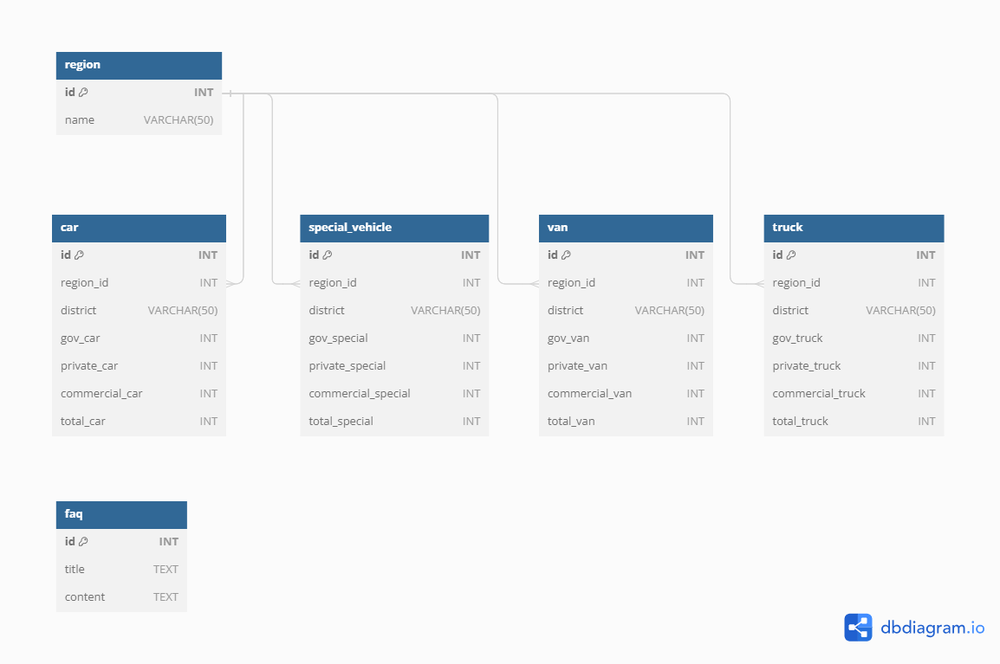

<div align="center">
    
</div>
<div align="center">
    <h2><span style="color:pink;">이민재</span> 민경원 허우영 송준호</h2>
    <div><strong>단위 프로젝트 주제는 전국 자동차 등록 현황 및 기업 FAQ 조회 시스템 입니다!<br></div></strog>
</div>
<div align="center">
    <h2>🛠️ Tech Stacks</h2>
    <div>
        
        
        
        
        <br/>
        
        
        
    </div>
</div>
<br><br>

---

# 🤗 시작하기 

이 프로젝트를 시작하려면 아래의 지침을 따르세요.


## 1️⃣ 프로젝트 클론

```
git clone https://github.com/SKNETWORKS-FAMILY-AICAMP/SKN01-1st-6Team.git
cd SKN01-1st-6Team
```
<br>

## 2️⃣ Requirements

```
pip install -r requirements.txt
```
<br>

## 3️⃣ 실행

```
if __name__ == "__main__":
    # car_crawling()
    # faq_crawling()
    # insert_db()
    Ui("Crawling Project (SKN01-1st-6Team)").run()
```
❗ 주석을 제거하고 크롤링과 데이터베이스에 insert하는 과정을 진행해야합니다.<br>

```
streamlit run runner.py
```

---

# 📋 ERD




## 🔍 테이블 설명

1. **Region 테이블**:
   - **_id_**: 기본 키, 자동 증가
   - **_name_**: 지역명, 고유값, NOT NULL

2. **Car 테이블**:
   - **_id_**: 기본 키, 자동 증가
   - **_region_id_**: region 테이블의 외래키
   - **_district_**: 시군구명
   - **_gov_car_**: 관용차 수
   - **_private_car_**: 자가용 수
   - **_commercial_car_**: 영업용 수
   - **_total_car_**: 총계

3. **Van 테이블**:
   - **_id_**: 기본 키, 자동 증가
   - **_region_id_**: region 테이블의 외래키
   - **_district_**: 시군구명
   - **_gov_van_**: 관용차 수
   - **_private_van_**: 자가용 수
   - **_commercial_van_**: 영업용 수
   - **_total_van_**: 총계

4. **Truck 테이블**:
   - **_id_**: 기본 키, 자동 증가
   - **_region_id_**: region 테이블의 외래키
   - **_district_**: 시군구명
   - **_gov_truck_**: 관용차 수
   - **_private_truck_**: 자가용 수
   - **_commercial_truck_**: 영업용 수
   - **_total_truck_**: 총계

5. **SpecialVehicle 테이블**:
   - **_id_**: 기본 키, 자동 증가
   - **_region_id_**: region 테이블의 외래키
   - **_district_**: 시군구명
   - **_gov_special_**: 관용차 수
   - **_private_special_**: 자가용 수
   - **_commercial_special_**: 영업용 수
   - **_total_special_**: 총계

6. **FAQ 테이블**:
    - **_title_**: FAQ 제목
    - **_content_**: FAQ 내용
